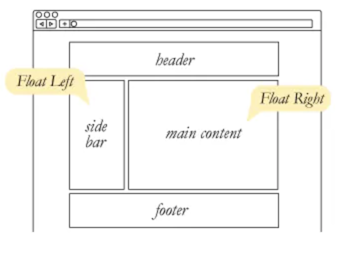
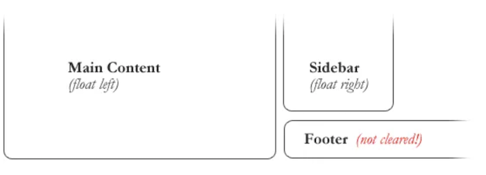
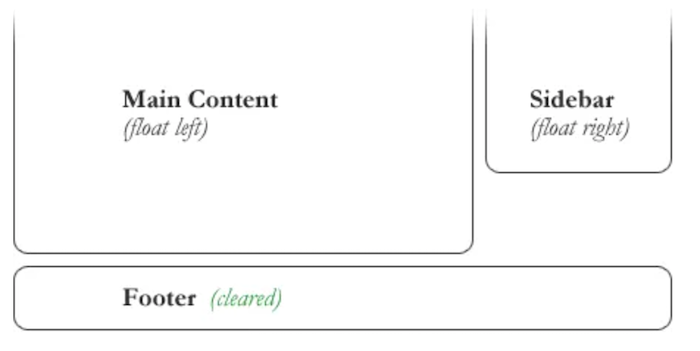

# HTML Links, CSS Layout, JS Functions

## HTML Links

### Linking to other sites / to other pages on the same website 

Links are created using the `<a>` element which has an attribute called **href**.

```html
<a href="https://www.google.com/">Google Search</a>

<a href = "https://en.wikipedia.org/wiki/History_of_the_United_States">USA History</a>
``` 

When you are linking to other pages within the same site, you do not need to specify the domain name in the URL. You can use a shorthand known as **relative** path.
```html
<a href = "about-me.html"></a>
```  

### Setting the Targets for Links  

The target attribute tells the browser where to open the linked document. There are four defined targets, and each target name starts with an underscore(_) character:

1. _blank 
    - Opens the linked document in a new window or tab.
2. _parent 
    - Opens the linked document in the parent window.
3. _self 
    - Opens the linked document in the same window or tab as the source document. This is the default hence it is not necessary to explicitly specify this value.
4. _top 
    - Opens the linked document in the full browser window.  

## Layout / CSS

### Position : 

1. static
    - every element has a static position by default, so the element will stick to the normal page flow.
2. relative
    - an element’s original position remains in the flow of the document, just like the static value. But now left/right/top/bottom/z-index will work. The positional properties “nudge” the element from the original position in that direction.
3. absolute 
    - the element is removed from the flow of the document and other elements will behave as if it’s not even there whilst all the other positional properties will work on it.
4. fixed
    - the element is removed from the flow of the document like absolutely positioned elements. In fact they behave almost the same, only fixed positioned elements are always relative to the document, not any particular parent, and are unaffected by scrolling.

> When you use _relative_, _fixed_, or _absolute_ positioning, boxes can overlap, the elements that appear later in the HTML code sit on top of those that are earlier in the page. If You want to control which element sits on top, you can use `z-index` property. Its value is a number, and the higher the number the closer that element is to the front.

### Float  

To understand the purpose and origin of `float`, we can look to print design. In a print layout, images may be set into the page such that text wraps around them as needed. This is commonly and appropriately called “text wrap”. Here is an example of that.



Values: 

1. **none**: the element does not float. This is the initial value.
2. **left**: floats the element to the left of its container.
3. **right:** floats the element to the right of its container.
4. **Inherit**: the element inherits the float direction of its parent. 

### Clearing The Float 

Float’s sister property is clear. An element that has the clear property set on it will not move up adjacent to the float like the float desires, but will move itself down past the float. Again an illustration is more helpful than words:



```css 

#footer {
   clear: both;
}
``` 

  

### Fixed / Liquid Layouts

**Fixed Layout** is a layout in which the width of main container is fixed ( in pixels). Popular Fixed width layouts are 1200px and 960px (used earlier).

**Properties of Fixed Layout**:
- Fixed width in pixels.
- Text doesn't scroll down when browser windows in minimised.
- Independent of screen size.
- Horizontal Scroll will come when screen size is less than width of main container.

**Liquid Layouts** is a layout in which the width of main container is flexible( in percentage). Whatever the screen-size is, the layout will remain same.

**Properties of Fluid Layout**:
- Width is in percentage.
- Text scroll down when zoom in or zoom out
- Dependent of screen size.
- Horizontal Scroll will Never come on any screen unless any fixed content is inside.  


## JavaScript Functions  

**Functions** are one of the fundamental building blocks in JavaScript. A function is a reusable set of statements to perform a task or calculate a value. **Functions** can be passed one or more values and can return a value at the end of their execution. In order to use a function, you must define it somewhere in the scope where you wish to call it.

```javascript
// Defining the function:
function sum(num1, num2) {
  return num1 + num2;
}
 
// Calling the function:
sum(3, 6); // 9
``` 

### Function Parameters

Inputs to functions are known as parameters when a function is declared or defined.  

Parameters are used as variables inside the function body.  

When the function is called, these parameters will have the value of whatever is passed in as arguments. _It is possible to define a function without parameters._

```javascript
// The parameter is name
function sayHello(name) {
  return `Hello, ${name}!`;
}
``` 

### Function Declaration

Function declarations are used to create named functions. These functions can be called using their declared name. Function declarations are built from:

- The function keyword.
- The function name.
- An optional list of parameters separated by commas enclosed by a set of parentheses ().
- A function body enclosed in a set of curly braces {}.  

```javascript
function add(num1, num2) {
  return num1 + num2;
}
``` 

### Calling Functions

Functions can be **called**, or **executed**, elsewhere in code using parentheses following the function name. When a function is called, the code inside its function body runs. Arguments are values passed into a function when it is called.

```javascript
// Defining the function
function sum(num1, num2) {
  return num1 + num2;
}
 
// Calling the function
sum(2, 4); // 6
```   

[<== Back to ReadMe](../README.md)
