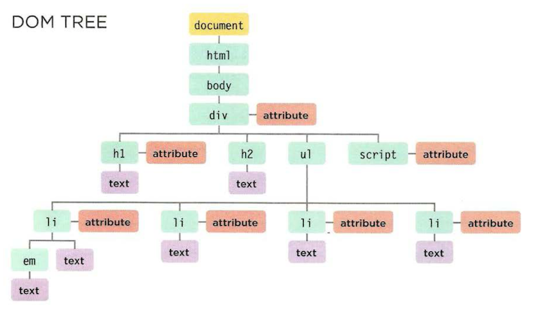

# Objects and the DOM (Document Object Model)

## What is an object?

Objects group together a set of variables and functions to create a model of something you would recognize from the real world. In an object, variables and functions take on new names.  

**In an Object: Variables become known as properties** 
- If a variable is part of an _object_, it is calles **property**. Properties tell us about the object, such as the nsme of a hotel or the number of rooms it has.  

**In an Object: Functions become known as methods**
- If a function is part of an _object_, it is called a **method**. Methods represent tasks that are associated with the object. For example, you can check how many rooms are available by subtracting the number of booked rooms from the total number of rooms.   

### Creating an Object

```javascript 

var hotel = {
  name: 'Quay',
  rooms: 40,
  booked: 25,
  gym: true,
  roomTypes: ['twin', 'double', 'suite'],
  checkAvailability: function() {
    return this.rooms - this.booked;
  }
};
```  
### Accessing an Object and Dot notation

To access a property or method of an object you use the name of the object, followed by a period, then the name of the property or method. This is known as **dot notation**.  

Also we can access the properties or methods of an object using square bracket syntax.

```javascript 
// Dot notation

var hotelName = hotel.name;
var roomsFree = hotel.checkAvailability();

//Square bracket syntax

var hotelName = hotel['name'];
var roomsFree = hotel['checkAvailability']();
``` 

Square bracket syntax is most commonly used when:
- The name of the property or method contains special characters (such as a dash)
- The name of the property is a number (technically allowd, but should generally be avoided)
- A variable is being used in place of the property name.

### Document Object Model (DOM)

The **Document Object Model**  specifies how browser should create a model of an HTML page and how JavaScript can access and update the contents of a web page while it is in the browser window.  

The **DOM** is neither part of HTML, nor part of JavaScript; it is separate set of rules. It is implemented by all major browser makers, and covers two primary areas: 

1. Making a Model of the HTML Page
    - When the browser loads a web page, it creates a model of the page in memory.
    - The DOM specifies the way in which the browser should structure this model using a **DOM tree**.
    - The DOM is called an object model because the model (the DOM tree) is made of objects.
    - Each object represents a different part of the page loaded in the browser window.
2. Accessing and changing the HTML Page
    - The DOM also defines methods and properties to access and update each object in this model, which in turn updates what the user sees in the browser.
    
**Body of HTML Page**

```html

<html>
  <body>
    <div id = "page">
      <h1 id ='header'>List</h1>
      <h2>Buy groceries</h2>
      <ul>
        <li id = "one" class = "hot"><em>fresh</em> figs</li>
        <li id = "two" class = "hot">pine nuts</li>
        <li id = "three" class = "hot">honey</li>
        <li id = "four">balsamic vinegar</li>
      </ul>
      <script src = "js/list.js"></script>
    </div>
  </body>
</html>
``` 



As a browser loads a web page, it creates a model of that page.
The model is called a DOM tree, and it is stored in the browsers' memory. It consists of four main types of nodes.

1. The Document Node 
    - Every element, attribute, and piece of text in the HTML is represented by its own DOM node. At the top of the tree a document node is added; it represents the entire page.
    - When you access any element, attribute, or text node, you navigate to it via the document node. It is the starting point for all visits to the DOM tree.
2. Element Nodes 
    - HTML elements describe the structure of an HTML page. (The `<h1> - <h6>` elements describe what parts are headings; the `<p>` tags indicate where paragraphs of text start and finish; and so on.)
    - To access the DOM tree, you start by looking for elements. Once you find the element you want, then you can access its text and attribute nodes if you want to. This is why you start by learning methods that allow you to access element nodes, before learning to access and alter text or attributes.
3. Attribute Nodes
    - The opening tags of HTML elements can carry attributes and these are represented by attribute nodes in the DOM tree.
    - Attribute nodes are not children of the element thar carries them; they are part of that element. Once you access an element, there are specific JavaScript methods and properties to read or change that element's attributes. For example, it is common to change the values of cl ass attributes to trigger new CSS rules that affect their presentation.
4. Text Nodes
    - Once you have accessed an element node, you can then reach the text within that element. This is stored in its own text node.
    - Text nodes cannot have children. If an element contains text and another child element, the child element is not a child of the text node but rather a child of the containing element. (See the `<em>` element on the first `<li>` item.) This illustrates how the text node is always a new branch of the DOM tree, and no further branches come off of it.  

### Working with the DOM tree

Accessing and updating the DOM tree involves two steps: 
1. Locate the node that represents the element you want to work with.
2. Use its text content, child elements, and attributes

#### Step 1: Access The Elements 

1. Select an individual element node 
    - `getElementById('id')`- uses the value of an element's **id attribute** (which should be unique within the page)
    - `querySelector('css selector')` - uses CSS selector, and returns the first matching element
2. Select multiple elements (Nodelists)
    - `getElementsByClassName('class')`- selects all elements that have a specific value for their class attribute
    - `getElementsByTagName('tagName')` - selects all elements that have the specified tag name
    - `querySelectorAll('css selector')`- uses a CSS selector to select all matching elements.
3. Traversing between Element Nodes 
    - `parentNode`- selects the parent of the current element node (which will return just one element)
    - `previousSibling` / `nextSibling` - selects the previous or next sibling from the DOM tree
    - `firstChild`/ `lastChild` - select the first or last child of the current element. 

#### Step 2: Work with those Elements

1. Access / Update text Nodes
    - `nodeValue`- this property lets you to access or update contents of a text node
2. Work with HTML Content 
    - `innerHTML`- allows access to child elements and text content
    - `textContent`- allows access just to the text content
    - `createElement()`, `createTextNode()`, `appendChild()`/`removeChild()`- let you create new nodes, add nodes an dremove nodes froma tree.
3. Access of update Attribute Values
    - `hasAttribute()`- checks if an attribute
    - `getAttribute()`- gets its value
    - `setAttribute()`- updates the value
    - `removeAttribute()`- removes an attribute  

 ```javascript 
 //selecting elements using ID attributes
 
 //select the element and store it in variable 
 var el = document.getElementById('one');
 //change the value of the class attribute
 el.className = 'cool';

 //selecting elements using class attributes
 var elements = document.getElementsByClassName('hot'); // Find hot items

 if (elements.length > 2) {     // If 3 or more are found
      
      var el = elements[2];     // Select the third one from the Nodelist
      el.className = 'cool';    // Change the value of its class attribute
 }
 
 // selecting elements by tag name 

var elements = document.getElementsByTagName('li');   // Find <li> elements

if (elements.length > 0) {    // If 1 or more are found

  var el = elements[0];      // Select the first one using array syntax
  el.className = 'cool';     // Change the value of the class attribute
}
``` 

### Looping through a Nodelist 

 If you want to apply the same code to numerous elements, looping through a Nodelist is a powerful technique.  

 It involves finding out how many items are in the Nodelist, and then setting a counter to loop through them, one-by-one.

 ```javascript 

 var hotItems = document.querySelectorAll('li.hot');  //Store Nodelist in array

 if (hotItems.length > 0) {    // If it contains items

   for (var i = 0; i < hotItems.length; i++) {    //Loop through each item
       hotItems[i].className = 'cool';  // Change value of class attribute
   }
 }
``` 

> Explanation of an example above: 
In this example, the Nodelist is generated using `querySelectorAll()`,and it is looking for any `<li>` elements that have a class attribute whose value is **hot**.
The Nodelist is stored in a variable called **hotItems**, and the number of elements in the list is found using the length property.
For each of the elements in the Nodelist, the value of the cl ass attribute is changed to cool .


### Accessing & Changing a text Node 

```javascript

var itemTwo = document.getElementById('two');  //Get second list item

var elText = itemTwo.firstChild.nodeValue;   // Get its content

elText = elText.replace('pine nuts', 'kale');  // Change pine nuts to kale

itemTwo.firstChild.nodeValue = elText;   // Update the list item
``` 

### Adding an element to the DOM tree

```javascript 

//Create a new element and store it in a variable 
var newEl = document.createElement('li');

//Create a text node and store it in a variable 
var newText = document.createTextNode('quinoa');

//Attach the new text node to the new element 
newEl.appendChild(newText);

//Find the position where the new element should be added 
var position = document.getElementsByTagName('ul')[0];

//Insert the new element into its position
position.appendChild(newEl);
``` 

### Removing an element from DOM tree

```javascript 

var removeEl = document.getElementsByTagName('li')[3];  // The element to remove

var containerEl = removeEl.parentNode;   // Its containing element

containerEl.removeChild(removeEl);   // Removing the element
```   

[<== Back to ReadMe](../README.md)


