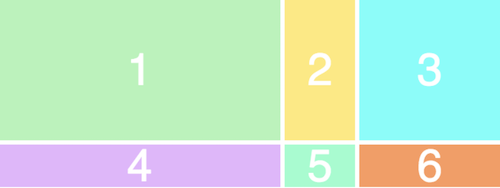

# CSS Layout

## Grid Layout

CSS Grid allows us to write better layouts using the in-browser capability of grids.  

Basic Terminology:
1. Columns
2. Rows
3. Cells
4. Grid Lines
5. Gutter


Basic Concepts: 
- Grid Layout gives us a method of creating grid structures that are described in CSS and not in HTML. 

- Grid Layout lets us properly separate the order of elements in the source from their visual presentation. As a designer this means you are free to change the location of page elements as is best for your layout at different breakpoints and not need to compromise a sensible structured document for your responsive design.

- It’s very easy to make grid adapt to the available space. With each element having an area on the grid, things are not in risk of overlapping due to text size change, more content than expected or small viewports.

- Unlike with an HTML table-based layout, you can layer items on the grid. So one item can overlap another if required.

```html 
<div class="wrapper">
  <div>1</div>
  <div>2</div>
  <div>3</div>
  <div>4</div>
  <div>5</div>
  <div>6</div>
</div>
``` 

```css
/* To turn our wrapper div into a grid, we simply give it a display of
grid */
.wrapper {
    display: grid;
    grid-template-columns: 200px 50px 100px;
    grid-template-rows: 50px 50px;
}
/* RESULT: */
``` 


## Float CSS

Float is a CSS positioning property. To understand its purpose and origin, we can look to print design. In a print layout, images may be set into the page such that text wraps around them as needed. This is commonly and appropriately called “text wrap”.  


In web design, page elements with the CSS float property applied to them are just like the images in the print layout where the text flows around them. Floated elements remain a part of the flow of the web page. This is distinctly different than page elements that use absolute positioning. Absolutely positioned page elements are removed from the flow of the webpage, like when the text box in the print layout was told to ignore the page wrap. Absolutely positioned page elements will not affect the position of other elements and other elements will not affect them, whether they touch each other or not.

## Position

The position property can help to manipulate the location of an element.  

**Values**:

1. static
    -  every element has a static position by default, so the element will stick to the normal page flow. So if there is a left/right/top/bottom/z-index set then there will be no effect on that element.
2. relative
    -  an element’s original position remains in the flow of the document, just like the static value. But now left/right/top/bottom/z-index will work. The positional properties “nudge” the element from the original position in that direction.
3. absolute 
    - the element is removed from the flow of the document and other elements will behave as if it’s not even there whilst all the other positional properties will work on it.
4. fixed 
    - the element is removed from the flow of the document like absolutely positioned elements. In fact they behave almost the same, only fixed positioned elements are always relative to the document, not any particular parent, and are unaffected by scrolling.
5. sticky (experimental) 
    - the element is treated like a relative value until the scroll location of the viewport reaches a specified threshold, at which point the element takes a fixed position where it is told to stick.
6. inherit 
    - the position value doesn’t cascade, so this can be used to specifically force it to, and inherit the positioning value from its parent.

  

[<== Back to ReadMe](../README.md)