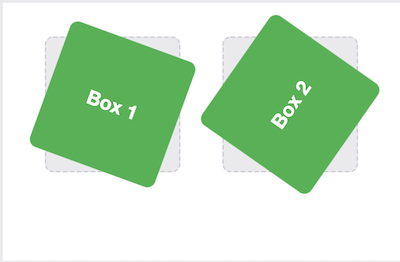
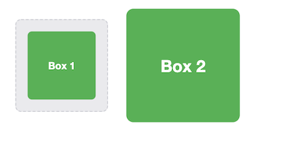
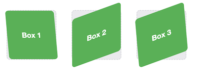
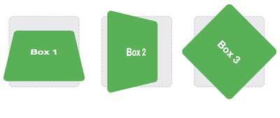
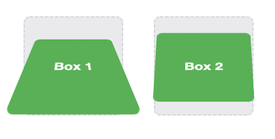
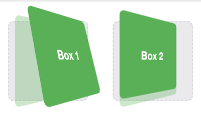

# CSS Transforms, Transitions, and Animations

## CSS Transforms

The **transform** property comes in two different settings, two-dimensional and three-dimensional. Each of these come with their own individual properties and values.

### 2D Transforms
    - Elements may be distorted, or transformed, on both a two-dimensional plane or a three-dimensional plane.
    - Two-dimensional transforms work on the x and y axes, known as horizontal and vertical axes.

1. Rotate Demo 
    - The rotate value provides the ability to rotate an element from 0 to 360 degrees. 
    - Using a positive value will rotate an element clockwise, and using a negative value will rotate the element counterclockwise.

```css 
/* rotate demo */
.box-1 {
  transform: rotate(20deg);
}
.box-2 {
  transform: rotate(-55deg);
}
``` 


2. 2D Scale
    - Scale value within the transform property allows to change the appeared size of an element. 
    - _The default scale value is 1_, therefore any value between .99 and .01 makes an element appear smaller while any value greater than or equal to 1.01 makes an element appear larger.
```css 
.box-1 {
  transform: scale(.75);
}
.box-2 {
  transform: scale(1.25);
}
``` 


3. 2D Skew
    -  Used to distort elements on the horizontal axis, vertical axis, or both. 
    - To distort an element on both axes the skew value is used, declaring the x axis value first, followed by a comma, and then the y axis value.
    - The distance calculation of the skew value is measured in units of degrees. Length measurements, such as pixels or percentages, do not apply here.
```css 

.box-1 {
  transform: skewX(5deg);
}
.box-2 {
  transform: skewY(-20deg);
}
.box-3 {
  transform: skew(5deg, -20deg);
}
``` 



### 3D Transforms

Using three-dimensional transforms we can change elements on the z axis, giving us control of depth as well as length and width.

1. 3D Rotate
    - With three-dimensional transforms we can rotate an element around any axes. To do so, we use three new transform values, including rotateX, rotateY, and rotateZ.

```css 
.box-1 {
  transform: perspective(200px) rotateX(45deg);
}
.box-2 {
  transform: perspective(200px) rotateY(45deg);
}
.box-3 {
  transform: perspective(200px) rotateZ(45deg);
}
```


2. 3D Scale
    - By using the scaleZ three-dimensional transform elements may be scaled on the z axis. This isn’t extremely exciting when no other three-dimensional transforms are in place

```css 
.box-1 {
  transform: perspective(200px) scaleZ(1.75) rotateX(45deg);
}
.box-2 {
  transform: perspective(200px) scaleZ(.25) rotateX(45deg);
}
```


3. **Transform Style Demo**

```html
<div class="rotate three-d">
  <figure class="box">Box 1</figure>
</div>
<div class="rotate">
  <figure class="box">Box 2</figure>
</div>
```
```css 
/* The transform-style property needs to be placed on the parent element, above any nested transforms.  */
.rotate {
  transform: perspective(200px) rotateY(45deg);
}
/* The preserve-3d value allows the transformed children elements to appear in their own three-dimensional plane  */
.three-d {
  transform-style: preserve-3d;
}
/* flat value forces the transformed children elements to lie flat on the two-dimensional plane */
.box {
  transform: rotateX(15deg) translateZ(20px);
  transform-origin: 0 0;
}
``` 


## CSS Transitions & Animations

**Transitions** provide a change from one state to another, while **animations** can set multiple points of transition upon different keyframes.  

For a **transition** to take place, an element must have a change in state, and different styles must be identified for each state. The easiest way for determining styles for different states is by using the _:hover_, _:focus_, _:active_, and _:target_ pseudo-classes.  

There are four transition related properties in total, including:
1. transition-property
    - determines exactly what properties will be altered in conjunction with the other transitional properties.
2. transition-duration
    - value of this property can be set using general timing values, including seconds (s) and milliseconds (ms).
3. transition-timing-function
    - used to set the speed in which a transition will move.
    - more popular keyword values include _linear_, _ease-in_, _ease-out_, and _ease-in-out_.
4. transition-delay. (Not all of these are required to build a transition, with the first three are the most popular.)
    - sets a time value, seconds or milliseconds, that determines how long a transition should be stalled before executing.

**Shorthand Transitions**

```css 

.box {
  background: #2db34a;
  border-radius: 6px;
  transition: background .2s linear, border-radius 1s ease-in 1s;
}
.box:hover {
  color: #ff7b29;
  border-radius: 50%;
}
``` 

## Animations

To set multiple points at which an element should undergo a transition, we need to use the `@keyframes` rule. The `@keyframes` rule includes the animation name, any animation breakpoints, and the properties intended to be animated.

```css 
@keyframes slide {
  0% {
    left: 0;
    top: 0;
  }
  50% {
    left: 244px;
    top: 100px;
  }
  100% {
    left: 488px;
    top: 0;
  }
}
.stage {
  height: 150px;
  position: relative;
}
.ball {
    height: 50px;
    position: absolute;
    width: 50px;
}
/* animation-name property is used with the animation name, identified from the @keyframes rule, as the property value.  */
/* function and delay can be declared using the animation-timing-function and animation-delay properties respectively. */
.stage:hover .ball {
  animation-name: slide;
  animation-duration: 2s;
  animation-timing-function: ease-in-out;
  animation-delay: .5s;
}
```

>By default, animations run their cycle once from beginning to end and then stop. To have an animation repeat itself numerous times the animation-iteration-count property may be used. Values for the animation-iteration-count property include either an integer or the infinite keyword. Using an integer will repeat the animation as many times as specified, while the infinite keyword will repeat the animation indefinitely in a never ending fashion.  

**Shorthand Animations**

 Animations, just like transitions, can be written out in a shorthand format. This is accomplished with one animation property, rather than multiple declarations.  

 The order of values within the animation property should be:
 1. animation-name 
 2. animation-duration 
 3. animation-timing-function
 4. animation-delay
 5. animation-iteration-count
 6. animation-direction
 7. animation-fill-mode 
 8. animation-play-state.
```css 
.stage:hover .ball {
  animation: slide 2s ease-in-out .5s infinite alternate;
}
.stage:active .ball {
  animation-play-state: paused;
}
``` 


[<== Back to ReadMe](../README.md)