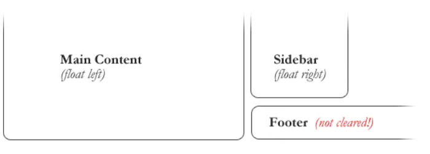

# SMACSS and Responsive Web Design

**Resources**:
1. Responsive Web Design
    - https://learn.shayhowe.com/
2. SMACSS Official Documentation
    - http://smacss.com/
3. Floats / Grids
    - https://css-tricks.com/

## SMACSS | Scalable and Modular Architecture for CSS

At the very core of SMACSS is categorization. By categorizing CSS rules, we begin to see patterns and can define better practices around each of these patterns.  

There are five types of categories:

1. Base
    - default rules.
2. Layout
    - divides the page into sections. Layouts hold one or more modules together.
3. Modules 
    - reusable, modular parts of design. They are the callouts, the sidebar sections, the product lists and so on.
4. State
    - ways to describe how modules or layouts will look when in a particular state. Is it hidden or expanded? Is it active or inactive? They are about describing how a module or layout looks on screens that are smaller or bigger. They are also about describing how a module might look in different views like the home page or the inside page.
5. Theme
    - similar to state rules in that they describe how modules or layouts might look. Most sites don’t require a layer of theming but it is good to be aware of it.  

## Responsive Web Design  

Responsive web design is the practice of building a website suitable to work on every device and every screen size, no matter how large or small, mobile or desktop. Responsive web design is focused around providing an intuitive and gratifying experience for everyone. 

**Responsive vs. Adaptive vs. Mobile**

1. Responsive
    - generally means to react quickly and positively to any change.
2. Adaptive
    - means to be easily modified for a new purpose or situation
3. Mobile 
    - means to build a separate website commonly on a new domain solely for mobile users.  

**Flexible Layouts**

- broken down into three main components:

1. Flexible layouts 
    - is the practice of building the layout of a website with a flexible grid, capable of dynamically resizing to any width.
    - Flexible grids are built using relative length units, most commonly `percentages` or `em` units. 
    - These relative lengths are then used to declare common grid property values such as `width`, `margin`, or `padding`.
2. Media queries
    - provide the ability to specify different styles for individual browser and device circumstances.
    - There are a couple different ways to use media queries, using the `@media` rule inside of an existing style sheet, importing a new style sheet using the `@import` rule, or by linking to a separate style sheet from within the HTML document.
    - Each media query may include a media type followed by one or more expressions. (`all` / `screen` / `print` / `tv` / `braille`)
    - There are three different logical operators available for use within media queries, including _and_, _not_, and _only_.
    - Using the `and` logical operator within a media query allows an extra condition to be added, making sure that a browser or devices does both a, b, c, and so forth.
```css 
@media all and (min-width: 800px) and (max-width: 1024px) {...}
``` 
3. Flexible media
    - Images, videos, and other media types need to be scalable, changing their size as the size of the viewport changes.
    - quick way to make media scalable is by using the max-width property with a value of 100%. _Doing so ensures that as the viewport gets smaller any media will scale down according to its containers width._
    - To get embedded media to be fully responsive, the embedded element needs to be **absolutely** positioned within a parent element. The parent element needs to have a **width of 100%** and also needs to have a **height of 0**.

```css
/* HTML
<figure>
  <iframe src="https://www.youtube.com/embed/4Fqg43ozz7A"></iframe>
</figure> */
figure {
  height: 0;
  padding-bottom: 56.25%; /* 16:9 */
  position: relative;
  width: 100%;
}
iframe {
  height: 100%;
  left: 0;
  position: absolute;
  top: 0;
  width: 100%;
}
``` 

## All About Floats  

Float is a CSS positioning property. To understand its purpose and origin, we can look to print design. In a print layout, images may be set into the page such that text wraps around them as needed. This is commonly and appropriately called “text wrap”. 

  

**Floated elements _remain a part of the flow of the web page_.**  

Values: 

1. **none**: the element does not float. This is the initial value.
2. **left**: floats the element to the left of its container.
3. **right:** floats the element to the right of its container.
4. **Inherit**: the element inherits the float direction of its parent. 

### Clearing the Float 

An element that has the clear property set on it will not move up adjacent to the float like the float desires, but will move itself down past the float. 



```css 

/* To fix problem above, the footer can be cleared to ensure it stays beneath both floated columns. */
#footer {
   clear: both;
}
``` 


## CSS Grid Layout  

CSS Grid Layout is a 2-dimensional system, meaning it can handle both columns and rows, unlike `flexbox` which is largely a 1-dimensional system.  

### Terminology 

1. Grid Container
    - The element on which display: grid is applied. It’s the direct parent of all the grid items.

```html 
<!-- .container is the grid container.  -->
<div class="container">
  <div class="item item-1"> </div>
  <div class="item item-2"> </div>
  <div class="item item-3"> </div>
</div>
``` 

2. Grid Item
    - The children of the grid container.

```html 
<!-- the .item elements are grid items, but .sub-item isn’t.  -->
<div class="container">
  <div class="item"> </div>
  <div class="item">
    <p class="sub-item"> </p>
  </div>
  <div class="item"> </div>
</div>
``` 
3. Grid Line
    - The dividing lines that make up the structure of the grid. They can be vertical or horizontal.

4. Grid Cell
    - The space between two adjacent row and two adjacent column grid lines. It’s a single “unit” of the grid.

5. Grid Track
    - The space between two adjacent grid lines.  


