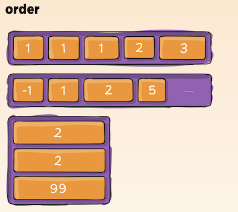

# Flexbox and Templating 

**Resources:**
1. Flexbox
    - https://css-tricks.com/snippets/css/a-guide-to-flexbox/ 
2. Templating
    - https://1sherlynn.medium.com/ 

## Flexbox CSS 

The **_Flexbox Layout_** (Flexible Box) module aims at providing a more efficient way to lay out, align and distribute space among items in a container, even when their size is unknown and/or dynamic. 

**Properties for the Parent Element:**

1. `display: flex` 
    - defines a flex container (used on parent container)
    - enables a flex context for all its direct children
2. `flex-direction`
    - establishes the main-axis, thus defining the direction flex items are placed in the flex container.
    - `row (default)` / `row-reverse` / `column` / `column-reverse`
    - 
3. `flex-wrap`
    - allow the items to wrap as needed
    - `nowrap` / `wrap` / `wrap-reverse`
    - 
4. `justify-content`
    - defines the alignment along the main axis.
    - `flex-start` / `flex-end` / `center` / `space-between` / `space-around` / `space-evenly` / `start` / `end` / `left` 
    - safest values are flex-start, flex-end, and center.
    - 
5. `align-items`
    - defines the default behavior for how flex items are laid out along the cross axis on the current line. 
    - `stretch` / `flex-start` / `flex-end` / `center` / `baseline` 
    - 
6. `align-content`
    - aligns a flex container’s lines within when there is extra space in the cross-axis
    - This property only takes effect on multi-line flexible container
    - `flex-start` / `flex-end` / `center` / `space-between` / `space-around` / `space-evenly` / `stretch` / `start` / `end` / `baseline`  
    - 

**Properties for the Children Elements:**

1. `order`
    - controls the order in which flex items appear in the flex container.
    - `order: 5; /* default is 0 */`
    - 
2. `flex-grow`
    - defines the ability for a flex item to grow if necessary.
    - `flex-grow: 4; /* default 0 */`
    - 
3. `flex-shrink`
    - defines the ability for a flex item to shrink if necessary.
    - `flex-shrink: 3; /* default 1 */`
4. `flex-basis`
    - defines the default size of an element before the remaining space is distributed.
    - can be a length (e.g. 20%, 5rem, etc.) or a keyword. 
5. `align-self`
    - allows the default alignment (or the one specified by align-items) to be overridden for individual flex items.
    - 

## Javascript Templating

Javascript templating is a fast and efficient technique to render client-side view templates with Javascript by using a JSON data source. The template is HTML markup, with added templating tags that will either insert variables or run programming logic.

### Mustache

**Mustache** is a logic-less template syntax. It can be used for HTML, config files, source code — anything. It works by expanding tags in a template using values provided in a hash or object.

1. There are no if statements, else clauses, or for loops. 
2. There are only tags. Some tags are replaced with a value, some nothing, and others a series of values.