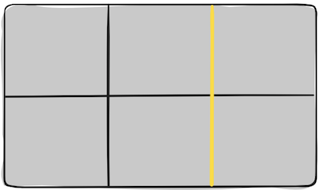
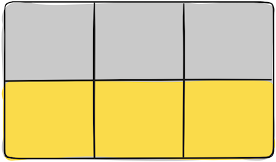

# Responsive Web Design and Regular Expressions

**Resources:**
1. A Complete Guide to Grid
    - https://css-tricks.com/snippets/css/complete-guide-grid/
2. Regex
    - https://levelup.gitconnected.com/wtf-is-regex-really-4dd563ee5ce0 

## Grid CSS 

CSS Grid Layout is a 2-dimensional system, meaning it can handle both columns and rows, unlike `flexbox` which is largely a 1-dimensional system.  

### Terminology 

1. Grid Container
    - The element on which display: grid is applied. It’s the direct parent of all the grid items.

```html 
<!-- .container is the grid container.  -->
<div class="container">
  <div class="item item-1"> </div>
  <div class="item item-2"> </div>
  <div class="item item-3"> </div>
</div>
``` 

2. Grid Item
    - The children of the grid container.

```html 
<!-- the .item elements are grid items, but .sub-item isn’t.  -->
<div class="container">
  <div class="item"> </div>
  <div class="item">
    <p class="sub-item"> </p>
  </div>
  <div class="item"> </div>
</div>
``` 
3. Grid Line
    - The dividing lines that make up the structure of the grid. They can be vertical or horizontal.
    - 
4. Grid Cell
    - The space between two adjacent row and two adjacent column grid lines. It’s a single “unit” of the grid.
    - 
5. Grid Track
    - The space between two adjacent grid lines.  
    - 


## Regex

A regular expression _(shortened as regex or regexp; also referred to as rational expression)_ is a sequence of characters that define a search pattern. Usually such patterns are used by string-searching algorithms for "find" or "find and replace" operations on strings, or for input validation.

[Regex cheatsheet](https://www.computerhope.com/jargon/r/regex.htm)  

RegEx allows us to check for patterns in text strings such as trying to match a valid email address or password. One of the great superpowers of RegEx is being able to define your own search criteria for a pattern to fit your needs, and it is like a language of its own.