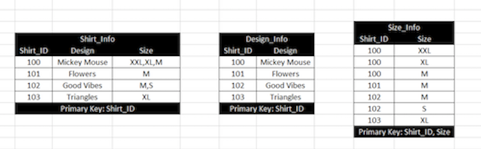
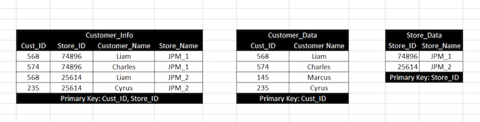

# DB Normalization

**Resources:**

1. [Database Normalization Explained in Simple English](https://www.essentialsql.com/get-ready-to-learn-sql-database-normalization-explained-in-simple-english/)
2. [Database Normalization Explained](https://towardsdatascience.com/database-normalization-explained-53e60a494495)
3. [Database Normalization Cheat Sheet](https://medium.com/@athishakaliannan/database-normalization-cheat-sheet-873964ab8cd2)

Normalization is a technique for organizing data in a database. It is important that a database is normalized to minimize redundancy (duplicate data) and to ensure only related data is stored in each table. It also prevents any issues stemming from database modifications such as insertions, deletions, and updates.  

The stages of organization are called **normal forms**:

1. **First Normal Form (1NF)**
    - Data is stored in tables with rows uniquely identified by a primary key
    - Data within each table is stored in individual columns in its most reduced form
    - There are no repeating groups
    - **Example: In Shirt_Info table, Size attribute is not atomic. Hence it can be decomposed into Design_Info and Size_Info as shown in the image.**
    - 
2. **Second Normal Form (2NF)**
    - Everything from 1NF
    - Only data that relates to a table’s primary key is stored in each table
    - 
    - **Example: In Customer_Info table, Store_Name depends on Store_ID and not on Cust_ID. This is a partial dependency. Hence, Customer_Info is not in second normal form (though it satisfies 1NF). It can be decomposed into Customer_Data and Store_Data as shown above.**
3. **Third Normal Form (3NF)**
    - Everything from 2NF
    - There are no in-table dependencies between the columns in each table