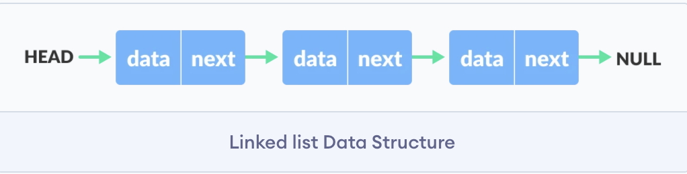

# Linked Lists

- [Data Structure and Algorithms - Linked List](https://www.tutorialspoint.com/data_structures_algorithms/linked_list_algorithms.htm)
- [Introduction to Linked Lists](https://www.studytonight.com/data-structures/introduction-to-linked-list)

## Basics

1. Link 
    - Each link of a linked list can store a data called an element.

2. Next 
    - Each link of a linked list contains a link to the next link called Next.

3. LinkedList 
    - A Linked List contains the connection link to the first link called First.

**Representation of Linked List:**

- A data item
- An address of another node

## Types of Linked List

1. Simple Linked List 
    - Item navigation is forward only.

2. Doubly Linked List 
    - Items can be navigated forward and backward.

3. Circular Linked List 
    - Last item contains link of the first element as next and the first element has a link to the last element as previous.

## Basic Operations

1. Insertion 
    - Adds an element at the beginning of the list.

2. Deletion 
    - Deletes an element at the beginning of the list.

3. Display 
    - Displays the complete list.

4. Search 
    - Searches an element using the given key.

5. Delete 
    - Deletes an element using the given key.

## Advantages / Disadvantages

**Advantages:**  

1. They are a dynamic in nature which allocates the memory when required.
2. Insertion and deletion operations can be easily implemented.
3. Stacks and queues can be easily executed.
4. Linked List reduces the access time.

**Disadvantages:**

1. The memory is wasted as pointers require extra memory for storage.
2. No element can be accessed randomly; it has to access each node sequentially.
3. Reverse Traversing is difficult in linked list.