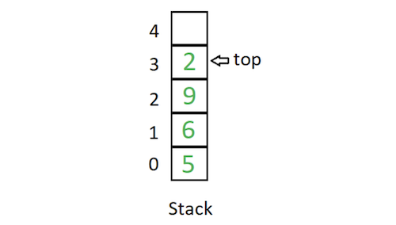
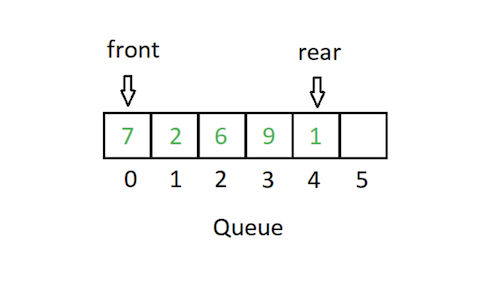

# Stacks and Queues

**Resources:**

- [Stacks and Queues](https://everythingcomputerscience.com/discrete_mathematics/Stacks_and_Queues.html#:~:text=Stack%20is%20a%20container%20of,%2Dout%20(FIFO)%20principle.)
- [Difference between Stack and Queue Data Structures](https://www.geeksforgeeks.org/difference-between-stack-and-queue-data-structures/)

## Stacks

- A stack is a linear, limited access data structure in which elements can be inserted and deleted only from one side of the list, called the **top**. 

**Operations:**

- Insertion of an element into stack is called `push` operation.
- Deletion of an element from the stack is called `pop` operation.

>A helpful analogy is to think of a stack of books; you can remove only the top book, also you can add a new book on the top.

## Queue

 - A queue is a linear data structure in which elements can be **inserted** only from one side of the list called `rear`, and the elements can be **deleted** only from the other side called the `front`. 

 **Operations:**

 - `Enqueue`. Means to insert an item into the back of the queue.
 - `Dequeue`. Means removing the front item

 

 >Example of a queue is a line of people outside of the store

 ### Difference between Stack and Queue Data Structures

| Stacks  | Queues  |
|---|---|
| Stacks are based on the LIFO principle, i.e., the element inserted at the last, is the first element to come out of the list.  | Queues are based on the FIFO principle, i.e., the element inserted at the first, is the first element to come out of the list.  |
| Insertion and deletion in stacks takes place only from one end of the list called the top.  | Insertion and deletion in queues takes place from the opposite ends of the list. The insertion takes place at the rear of the list and the deletion takes place from the front of the list.  |
| Insert operation is called push operation.  | Insert operation is called enqueue operation.  |
| Delete operation is called pop operation.  | Delete operation is called dequeue operation.  |
| In stacks we maintain only one pointer to access the list, called the top, which always points to the last element present in the list.  | In queues we maintain two pointers to access the list. The front pointer always points to the first element inserted in the list and is still present, and the rear pointer always points to the last inserted element.  |
| Stack is used in solving problems works on recursion.  | Queue is used in solving problems having sequential processing.  |