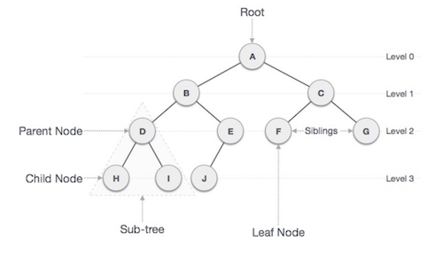
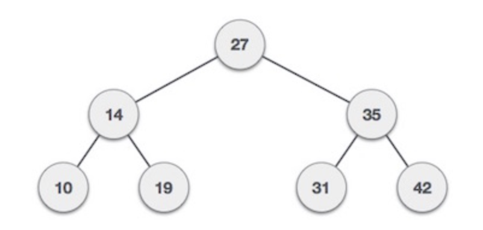

# Class 15 / Trees

**Resources:**
 - [Data Structure and Algorithms - Tree](https://www.tutorialspoint.com/data_structures_algorithms/tree_data_structure.htm)

## What is binary tree? 

Binary Tree is a special datastructure used for data storage purposes. A binary tree has a special condition that each node can have a maximum of two children.  

A binary tree has the benefits of both an ordered array and a linked list as search is as quick as in a sorted array and insertion or deletion operation are as fast as in linked list.

## Important terms with respect to tree

- **Path** 
  - Path refers to the sequence of nodes along the edges of a tree.

- **Root** 
  - The node at the top of the tree is called root. There is only one root per tree and one path from the root node to any node.

- **Parent** 
  - Any node except the root node has one edge upward to a node called parent.

- **Child** 
  - The node below a given node connected by its edge downward is called its child node.

- **Leaf**
  - The node which does not have any child node is called the leaf node.

- **Subtree** 
  - Subtree represents the descendants of a node.

- **Visiting**
  - Visiting refers to checking the value of a node when control is on the node.

- **Traversing** 
  - Traversing means passing through nodes in a specific order.

- **Levels** 
  - Level of a node represents the generation of a node. If the root node is at level 0, then its next child node is at level 1, its grandchild is at level 2, and so on.

- **Keys** 
  - Key represents a value of a node based on which a search operation is to be carried out for a node.

## Binary Search Tree Representation

Binary Search tree exhibits a special behavior. A node's left child must have a value less than its parent's value and the node's right child must have a value greater than its parent value.

