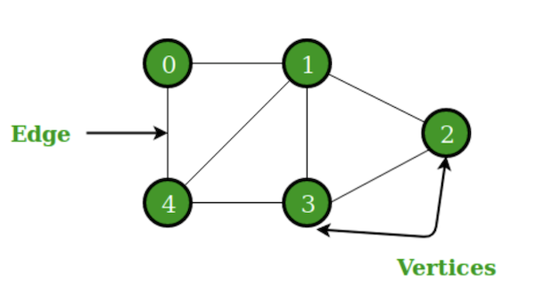

# Graphs 

**Resources:**

- [Graph Data Structure And Algorithms](https://www.geeksforgeeks.org/graph-data-structure-and-algorithms/)
- [Data Structure - Graph Data Structure](https://www.tutorialspoint.com/data_structures_algorithms/graph_data_structure.htm)

A Graph is a non-linear data structure consisting of nodes and edges. The nodes are sometimes also referred to as vertices and the edges are lines or arcs that connect any two nodes in the graph. 

>Graphs are used to solve many real-life problems. Graphs are used to represent networks. The networks may include paths in a city or telephone network or circuit network. Graphs are also used in social networks like linkedIn, Facebook. For example, in Facebook, each person is represented with a vertex(or node). Each node is a structure and contains information like person id, name, gender, locale etc.

## Terms

1. **Vertex** 
    - Each node of the graph is represented as a vertex. In the following example, the labeled circle represents vertices. Thus, A to G are vertices. We can represent them using an array as shown in the following image. Here A can be identified by index 0. B can be identified using index 1 and so on.

2. **Edge** 
    - Edge represents a path between two vertices or a line between two vertices. In the following example, the lines from A to B, B to C, and so on represents edges. We can use a two-dimensional array to represent an array as shown in the following image. Here AB can be represented as 1 at row 0, column 1, BC as 1 at row 1, column 2 and so on, keeping other combinations as 0.

3. **Adjacency** 
    - Two node or vertices are adjacent if they are connected to each other through an edge. In the following example, B is adjacent to A, C is adjacent to B, and so on.

4. **Path** 
    - Path represents a sequence of edges between the two vertices. In the following example, ABCD represents a path from A to D.

## Basic Operations

- **Add Vertex** 
  - Adds a vertex to the graph.

- **Add Edge** 
  - Adds an edge between the two vertices of the graph.

- **Display Vertex** 
  - Displays a vertex of the graph.