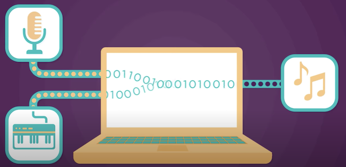

# How computers work?

## What makes a computer, a Computer?

The 4 things common to all computers:
 
- Input 
- Storage 
- Processing
- Output 

### That is what makes a computer, a computer.
1. Input 
    - Is the stuff that the world does or that you do that makes a computer do stuff  
    - You can tell computers what to do with the keyboard, you can tell them what to do with the mouse, the microphone, the camera and etc.

2. Storage & Processing
    - All these different inputs give a computer information, which is than stored in memory. A computer’s processor (CPU) takes information from memory. It manipulates it or changes it using an algorithm, which is just a series of commands. And then it sends the processed information back to be stored in memory again. This continues until the processed information is ready to be output.
    - The CPU (Central Processing Unit) is the master chip that controls all the other parts of the computer.

3. Output
    - How a computer outputs information depends on what the computer is designed to do. A computer display can show text, photos, videos, interactive games and etc.

## Binary & Data

In the binary number system, we only have two digits: **zero** and **one**. With these two digits, we can count up to any number.  

All other types of information (text, videos, photos and etc) can also be represented with numbers.

## Circuits and Logic

Every input or output of a computer is effectively a type of information, which can be represented by **ON** or **OFF** electrical signals, or **ones** and **zeros**. In order to process the information that comes in as input, and to make the information that is output. A computer needs to modify and combine the input signals. 

To do this, a computer uses millions of teeny electronic components, which come together to form **CIRCUITS**.  

Different electrical circuits can perform different simple calculations like subtraction or multiplication. In fact, all the information processing your computer does is just lots and lots of small simple operations put together.

## Hardware and Software

_**Hardware**_ and _**software**_ are interconnected, without _**software**_, the _**hardware**_ of a computer would have no function. However, without the creation of hardware to perform tasks directed by software via the central processing unit, software would be useless.  

[<== Back to ReadMe](README.md)