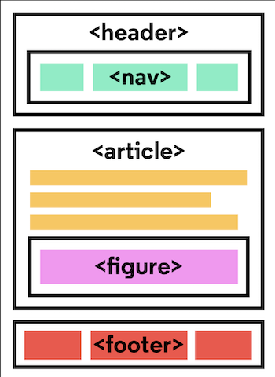

# HTML (HyperText Markup Language)

HTML is used to give content to a web page and instructs web browsers on how to structure that content.  

## HTML Document Standards

HTML files require certain elements to set up the document properly. We can let web browsers know that we are using HTML by starting our document with a document _type declaration_.

1. `<!DOCTYPE html>`
    - This declaration is an instruction, and it **must** be the first line of code in your HTML document. It tells the browser what type of document to expect, along with what version of HTML is being used in the document.

2. `<html> </html>`
    - To create HTML structure and content, we must add opening and closing `<html>` tags after declaring `<!DOCTYPE html>`. Anything between the opening `<html>` and closing `</html>` tags will be interpreted as HTML code.

3. `<head> </head>`
    - The `<head>` element contains the metadata for a web page. Metadata is information about the page that isn’t displayed directly on the web page. 

4. `<meta/>`
    - The `<meta>` tag allows you to supply all kinds of information about your page. It is not visible to users but fulfills a number of purposes such as telling search engines about your page, who created it, and wheather or not it is time sensative.

## Semantic HTML   

Semantic HTML introduces meaning to the code we write. Before Semantic HTML the elements didn’t have any meaning as to what it does or what content goes in it. An element such as `
` was used as a general-purpose element to create things from headers to footers to articles.

With Semantic HTML we were introduced to elements that tell developers and browsers exactly what it does and what content should go in it.

### Semantic Tags

- `<header> </header>`
- `<nav> </nav>`
- `<main> </main>`
- `<footer> </footer>`
- `<section> </section>`
    - defines elements in a document, such as chapters, headings, or any other area of the document with the same theme. 
- `<article> </article>`
    - holds content that makes sense on its own. Can hold content such as articles, blogs, comments, magazines, etc.
- `<aside> </aside>` 
    - used to mark additional information that can enhance another element but isn’t required in order to understand the main content. 
- `<figure> </figure>` 
    - used to encapsulate media such as an image, illustration, diagram, code snippet, etc.
- `<figcaption> </figcaption>` 
    - used to describe the media in the `<figure>` tag. 

