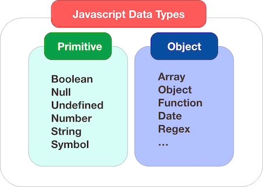

# JavaScript Language 

### How JS, HTML & CSS fit together?

1. **Content Layer**
    - .html files
    - this is where the content of the page lives. The HTML gives the page structure and adds semantics.

2. **Presentation Layer**
    - .css files
    - the CSS enchances the HTML page with rules that state how the HTML content is presented on the page.

3. **Behavior Layer** 
    - .js files 
    - this is where we can change how the page behaves, adding interactivity.

### Basic JavaScript Instructions

### What is variable?

A script will have to temporarily store the bits of information it needs to do its job. It can store this data in **variables**.  

You can compare variables to short-term memory, because once you leave the page, the browser will forget any information it holds.

> A variable is a good name for this concept because the data stored in a variable can change (or vary) each time a scripts runs.

#### How to declare? How to assign?

1. Declaration 
    - **var**, **let**, **const** - variable keywords.
```javascript
var price;
let username;
const password;
```

2. Shorthand declaration of multiple variables
```javascript
let price, username, password;
```

2. Assignment
```javascript
name = 'Bob';
password = 35432;
username = 'Bob_12';
```

### Data Types

1. Numeric Data Type 
2. String Data Type 
3. Boolean Data Type 
4. Arrays 
5. Objects 
6. ... 



### Rules for Naming Variables

- The name must begin with a letter, dollar sign($), or underscore(_). **It must not start with a number.**
- The name can contain letters, numbers, dollar sign ($), or an underscore (_). **Note that you must not use a dash (-) or a period(.) in a variable name.**
- You cannot use **keywords** or **reserved** words. Keywords are special words that tell the interpreter to do something. For example, var is a keyword used to declare a variable. Reserved words are ones that may be used in a future version of JavaScript.
- All variables are case sensitive, so **s**core and **S**core would be different variables name. But its bad practice to create two variables that have the same name using different cases.
- Use a name that describes the kind of information that the variables stores. For example firstName or lastName.
- If your variable name is made up of more than one word, use a capital letter for the first letter of every word after the first word. You can also use underscore.

